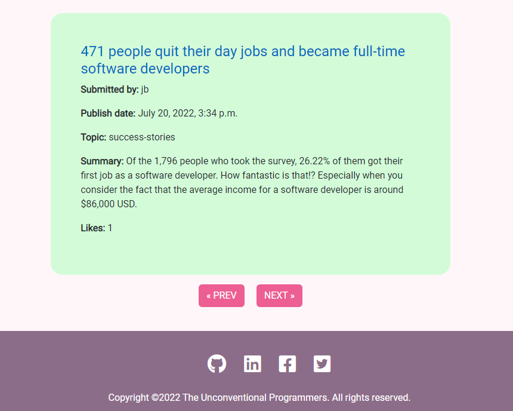
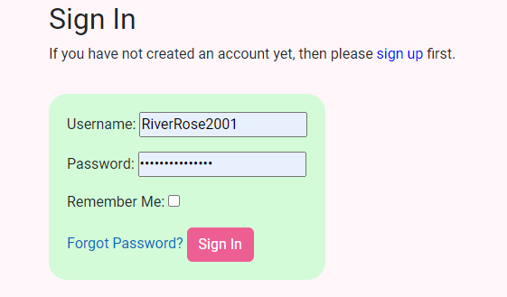
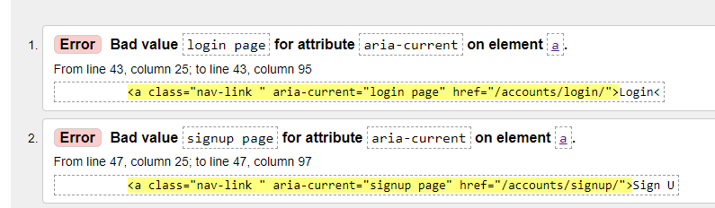

# PP4 - Full Stack Toolkit - The Unconventional Programmer

## Introduction
The Unconventional Programmer is a blog/reddit style website targetted at aspiring and junior developers. This site aims to share useful resources that will help people who have taken unconventional routes into programming and are at the start of their careers. It is a site that allows users to share their personal experiences via either creating a blog post themselves or commenting on existing ones.

The website was built in Django using Python, JavaScript, CSS and HTML. Users are able to create, edit, read and delete posts. On login a profile is automatically created for them which users can click into and edit/update. They are able to upload images for their blogs as well as a profile picture. Users can also comment on and like/unlike posts.

The site provides role based permissions for users to interact with the central dataset. Included is user authentication and Full CRUD functionality for blog posts. 

## Live Site
[Click here to view live site](https://the-unconventional-programmer.herokuapp.com/)

## Table of Contents
- [User Experience (UX)](#user-experience)
    - [Site Goals](#site-goals)
    - [Epics](#epics)
    - [User Stories](#user-stories)
- [Design](#design)
    - [Wireframes](#wireframes)
    - [Colour Scheme](#color-scheme)
    - [Fonts](#fonts)
- [Agile](#agile)
- [Database Schema](#database-schema)
- [Features](#features)
    - [Homepage](#homepage)
    - [Navbar](#navbar)
    - [Footer](#footer)
    - [Blog Posts List](#blog-posts-list)
    - [Pagination](#pagination)
    - [Blog Post](#blog-post)
    - [Comments](#comments)
    - [Likes](#likes)
    - [Login/Logout/Sign-up](#login--logout--sign-up)
    - [Create a Post](#create-a-post)
    - [Edit a Post](#edit-a-post)
    - [Delete a Post](#delete-a-post)
    - [Profile](#profile)
    - [Messages](#messages)
- [Future Development](#future-development)
- [Testing](#testing)
    - [Manual Testing](#manual-testing)
    - [Automated Testing](#automated-testing)
    - [Browser and Device Testing](#browser-and-device-testing)
    - [W3C Validator](#w3c-validatior)
    - [JS Lint](#js-lint)
    - [PEP8 Linter Results](#pep8-linter-results)
    - [Colour Contrast Checks](#colour-contrast-checks)
    - [Lighthouse Tool](#lighthouse-tool)
- [Solved Bugs](#solved-bugs)
- [Known Bugs](#known-bugs)
- [Technologies Used](#technologies-used)
    - [Languages Used](#languages-used)
    - [Frameworks, Libraries and Programs](#frameworks-libraries-and-programs)
    - [Databases](#databases)
- [Deployment](#deployment)
    - [Deploying to Heroku](#deploying-to-heroku)
    - [Forking Repository](#forking-repository)
    - [Cloning Repository](#cloning-repository)
- [Credits](#credits)
    - [Code](#code)
    - [Content](#content)
    - [Media](#media)
    - [Resources](#resources)
    - [Acknowledgements](#acknowledgements)

## User Experience
### Site Goals
- To provide users with a place to find helpful resources about early careers in programming
- To provide users a place to share their own knowledge and experiences
- To provide users a place where they can feel part of a community of like minded individuals
- To show users that they are not on their own and their are many people in the same shoes as them and feeling like them
- To show users that it get's better and that coding is a fantastic career choice

__Sites Ideal Users__
- Career changers currently studying at a coding bootcamp
- Junior developers who are right at the beginning of their work journey
- Graduates of programming related degree's
- People looking to share their experience and knowledge with those less experienced

### Epics
6 Epics were created which were further developed into 20 User Stories. The details of each epic along with the associated user stories can be found in the kanban board [here](https://github.com/users/Jbachtiger/projects/2). 

1. Initial Django Setup [#1](https://github.com/Jbachtiger/ci-pp4-the-unconventional-programmer/issues/1)
2. User Profile [#5](https://github.com/Jbachtiger/ci-pp4-the-unconventional-programmer/issues/5)
3. Sign in/Sign Out [#12](https://github.com/Jbachtiger/ci-pp4-the-unconventional-programmer/issues/12)
4. Blog Post [#17](https://github.com/Jbachtiger/ci-pp4-the-unconventional-programmer/issues/17)
5. Site Owner Goals [#24](https://github.com/Jbachtiger/ci-pp4-the-unconventional-programmer/issues/24)
6. Site Search [#15](https://github.com/Jbachtiger/ci-pp4-the-unconventional-programmer/issues/15)

### User Stories 
20 User stories were created from the 6 Epics and assigned the classifications of Must-have, Should-have, Could-have and Won't have. Each user story also includes acceptance criteria and tasks that need to be completed in order for that story to be closed. 

Below are links to each of the individual user stories that were completed within the projects initial release.

1. Initial Django Setup
    - Install Django and supporting libraries [#2](https://github.com/Jbachtiger/ci-pp4-the-unconventional-programmer/issues/2)
    - Keep secret keys secure [#3](https://github.com/Jbachtiger/ci-pp4-the-unconventional-programmer/issues/3)
    - Early deployment of site to Heroku [#4](https://github.com/Jbachtiger/ci-pp4-the-unconventional-programmer/issues/4)

2. User Profile
    - Register for an account [#6](https://github.com/Jbachtiger/ci-pp4-the-unconventional-programmer/issues/6)
    - User can view their profile [#7](https://github.com/Jbachtiger/ci-pp4-the-unconventional-programmer/issues/7)
    - User can edit their profile [#8](https://github.com/Jbachtiger/ci-pp4-the-unconventional-programmer/issues/8)

3. Sign in/Sign Out
    - User account Sign in/Sign out [#13](https://github.com/Jbachtiger/ci-pp4-the-unconventional-programmer/issues/13)
    - Features applicable to signed in users only [#14](https://github.com/Jbachtiger/ci-pp4-the-unconventional-programmer/issues/14)

4. Blog Post
    - Create a blog post [#18](https://github.com/Jbachtiger/ci-pp4-the-unconventional-programmer/issues/18)
    - View a blog post [#19](https://github.com/Jbachtiger/ci-pp4-the-unconventional-programmer/issues/19)
    - Update a blog post [#20](https://github.com/Jbachtiger/ci-pp4-the-unconventional-programmer/issues/20)
    - Delete a blog post [#21](https://github.com/Jbachtiger/ci-pp4-the-unconventional-programmer/issues/21)
    - Like/Unlike button [#22](https://github.com/Jbachtiger/ci-pp4-the-unconventional-programmer/issues/22)
    - Comment [#23](https://github.com/Jbachtiger/ci-pp4-the-unconventional-programmer/issues/23)

5. Site Owner Goals
    - Responsive templates [#26](https://github.com/Jbachtiger/ci-pp4-the-unconventional-programmer/issues/26)

For ease of reading, I have also listed all the completed user stories below:

- As a developer, I can set up Django and install all the supporting libraries to get started with the project, so that I am ready to start development
- As a developer, I can set up the Django development environment to secure the secrete keys, so that I do not expose the secret keys to the public or a party that should not see them
- As a developer, I can deploy the site to Heroku, so that I can confirm that everything is working before the development of the site and enable continuous testing with the production environment
- As a user I can create an account by registering my details so that I can comment and like posts
- As a user I can see the details of my user profile so that I can see my info and what others can see about me
- As a user I can edit my profile so that I can keep my information up to date
- As a user I can sign in and sign out of my account so that I can keep my account secure and private
- As a site owner I will restrict some features of the site to registered users only so that it encourages users to create an account with the site
- As a user I can create a blog post so that I can share my ideas and experience
- As a user I can read the blogs on the site so that I can benefit from the information shared
- As a user I can update a blog I have created so that I can correct mistakes I've made
- As a user I can delete a blog post I have written so that I can remove it from the site
- As a user I can like or unlike blog posts so that valuable blog posts are recognised as good content
- As a user I can comment on blogs so that I can have a community discussion around the topic and gain further insights
- As a site owner I can create my site to be fully responsive so that it provides a good user experience on all devices

## Design
### Wireframes
Before coding commenced, a set of wireframes were created to help me visualise roughly what my website would look like on desktop, tablet and mobile. It provided a starting point for me in terms of design. The finialised project went through many iterations and has changed from the inital wireframes however, inspiration was taken from these wireframes. 

- Homepage

- Blog Page

- Profile

- Sign-in

- Sign-up

### Color Scheme
- The colour scheme has been carefully chosen to ensure accessibility for all
- The colours compliment each other and ensure text is easily read
- The colours are consistent throughout the website and are used for specific purposes
- The main colours used throughout the website are:

As well as #8C6D89(light purple), #fff (white).

### Fonts
The font used in this project was Roboto with a backup of sans-serif. It was chosen for it's easy readabilty for users. Fonts were imported using Google Fonts.

## Agile
Throughout this project an agile approch was taken to developing the website. Each activity was broken down into smaller bite-sized more manageable actions from initially creating 6 Epics, which were then broken down into smaller User stories. Each of the user stories then had an acceptance criteria and list of tasks to complete. This made the overall project much more managable to build. GitHub labels were used to categorise the User Stories using the MoSCoW Prioritisation technique. This clealy defined what tasks were most important to complete and where the focus should be.

As mentioned above, a kanban board was created using GitHub Projects [here](https://github.com/users/Jbachtiger/projects/2) to help keep track of all the tasks including Todo, In Progress, Done and Future Development.

## Database Schema
Smart Draw was used to create a database schema to visulise the types of custom models this project might require. This schema was used as a guide to what needed to be added into each model. In the end only the Blog Post, Comment and Profile models were used. AllAuth was also used for the authentication system. This uses the built in Django User Model.

## Features
### Homepage

A simplistic homepage which clearly shows the sites purpose. The user is able to look through various blog posts until they find one that interests them. The purpose of this section is to introduce the site, have minimal distractions so the users attention is immediately drawn to the blog posts.

### Navbar

The navigation bar is featured on all pages, is responsive and has active links functionality so the user knows which link they are on by hovering on it in the navbar. It is identical on all pages and is easy to user to provide a good user experience. For mobile view the navbar reduces to a burger menu. The purpose of this feature is to allow users to navigate all pages easily across all devices without having to use a back button to get to the next page. Their is also authentication in place which will change what displays on the navbar depending on whether a user is logged in or not.

- Logged out Navbar

- Logged in Navbar

### Footer

The footer section includes links to relevant social links which all open up in a new tab to allow easy navigation for the user. They also have a hover effect added to them to make them stand out more and obivious to click. The copyright section is in place for legal reasons and the date is automatically updated using JavaScript. The footer is a good way to encourage users to connect via social media.

### Blog Posts List

The blog posts on the homepage are displayed in a single list view and provide a summary of what the blog contains. This provides user some quick information to see if they would like to find out more information about it including who submitted it, when it was published, the topic of the post, a short summary and how many likes it has received. This fields have all been included to provide the user a better experience and be able to make an informed decision as to whether they would like to continue into the blog post to read it.

### Pagination

The blog posts have had pagination functionality added to them so that 3 posts are displayed on each page. This has been implemented to improve the user experience and not overwhelm the user with information and blog posts. 

### Blog Post

Each post has a title followed by a submitted by field. There are also Edit and Delete buttons which have been put at the top of the page to ensure the user doesn't miss them. The main content is then added using the WYSIWYG CKeditor which provides basic styling and image uploads. At the bottm of the blog post there is a section for users to leave comments and talk to each other as well as a like/unlike option. The purpose of the blog layout is to make it as easy as possible for user to read the content, digest it and then contribute to it in the form of comments and likes. 

### Comments

Each blog post has a comment section where users can post their comments for that specific blog. The user can see the number of comments that have been made on the post, the name of the user who wrote each comment and when that comment was published. Users can only make a comment when signed in and will be prompted to sign-in or sign-up to in order to leave comments. This is a great way for users to interact with each other and the publisher, discuss the topic and ask/answer questions.

- Not signed into account

- Signed into account

### Likes

The user also has the ability to like and unlike blog posts. The purpose of this is to proivde useful feedback to the community on how popular/good a post is by rewarding that post with likes. If a user changes their mind they are able to remove their like from a post. Each like is counted on the blog page as well as on the homepage where the blog list sits. If a post is unliked by a user this is reflected in the count.

- Like

- Unlike

### Login / Logout / Sign-up

Django Allauth was installed and used to create the register, sign-in and sign-out functionality meaning the project would have the authentication foundations in place to expand functionality in future. These pages are needed to provide authenication and to allow users access to content that is restricted to those who have created a login. 

- Login

- Logout

- Sign-up

### Create a Post

If the user is logged in they can create a post. Current fields being captured include title, title tag, summary (which is used to display on the homepage), body (using the ckeditor) and topic. 

### Edit a Post

If the user is logged in they can edit a post they have created but not anyone elses. Same fields are included as with create a post.

### Delete a Post

Once a user has created a post they have the ability to delete their own post. They can do this by access the blog which they have created and wish to delete and clicking the delete button at the top of the page. They will then be taken a page asking them if they are sure they wish to delete their blog and to click confirm or go back to their blog page. 

### Profile

Once a user registers, they will have a profile page automatically created for them. The link to their profile page will appear in the navigation bar once logged in. If they navigate to this page, they will be able to update their username, email address, add a bio and upload an image. The purpose of this page is to proivde users with more control over their account and start to be able to customise their data. 

### Messages

To provide users with more feedback after they take certain actions, a messaging system has been added to let users know their desired actions have occured. For example:

-  Login

- Logout

- Profile Updated

These messages last for 2 seconds before automatically being timed out. Alternatively the user can click a little x to remove them.

### Admin Page

A superuser was created for this project to manage the backend admin section. Users with admin access have more functionality than normal users such as create, read, update and delete information such as users, posts, profiles and comments.

Access is restricted to approved admins only and can be accessed by adding /admin to the URL on the homepage and signing in if not already signed in through the front end of the site.

## Future Development

There is much functionality that can be added to this project in the future including:

- Blog search - a search box could be included on the homepage to allow users to search the site for posts by topic, author etc

- Dark Mode Customisation -  adding the ability to view the site in dark mode as this is a preferred method for developer to work with code and would be a nice add on

- Creating the functionality for users to be able to delete their account through their profile page and not just through admin

- Allowing users to reset/change their passwords

- Report abusive/innapropriate comments flag - this would alert an staff member/admin user to then manually review a comment and be able to remove it if deemed abusive/innapropriate

- Add comment nesting so that users are able to see specfic responses to their comments

- The ability for users to login via social networks such as Google or Facebook 

## Testing

Throughout development, errors and warnings were fixed as I went on such as indentation problems, syntax errors, missing code errors. I also went through all my code files once the main functionality and style of the website was completed by using validators and following best practice to elimate problems with lines too long, trailing white spaces, stray divs etc.

Google Chrome developer tools were used to inspect pages and look through code to help debug errors caused by HTML, CSS or JavaScript code.

Manual and automated testing has been carried out, as well as proof reading of the ReadMe file using Grammarly.

### Manual Testing

I have manually tested all the features of the website making sure to go through them with different browsers and devices sizes. I have also checked the sites features against the orignal user stories to ensure they have all been actioned. 

__User Stories__

__Features__

### Automated Testing

### Browser and Device Testing

__Browsers__

- The website was tested on the following browsers: Goolge Chrome, Firefox, Microsoft Edge and Safari.
- For each browser, functionality was tested including links and the responsive design.
- The website performed as intended and the responsive design was checked using developer tools across multiple devices with structural integrity holding for the various sizes.

__Devices Tested__

The website was viewed on a variety of devices of all sizes including:
- Windows 11 Desktop (screen resoultions tested in 2560x1080 and 1920x1080)
- Macbook Pro (13 inch 2015 version)
- Moto G4
- Galaxy S5
- Pixel 2
- Pixel 2 XL
- Iphone 5/SE
- Iphone 6/7/8
- Iphone 6/7/8 Plus
- Iphone X
- Ipad
- Ipad Pro
- Surface Duo

### W3C Validatior

The official W3C Markup Validator was used to validate both the html and css of the project to ensure there were no syntax errors within the site. 

__W3C HTML Markup Validator__

The below screenshots show the error messages that were found during the html pages validation process. All errors have been fixed and none remian on any of the html pages.

[Link to commit](https://github.com/Jbachtiger/ci-pp4-the-unconventional-programmer/commit/170c50818ef3ae229b1f13770a6d5d77efe045de) for fix

[Link to commit](https://github.com/Jbachtiger/ci-pp4-the-unconventional-programmer/commit/4bbda0d2480e81597f9616013f9671f5b1bd73ca) for fix

[Link to commit](https://github.com/Jbachtiger/ci-pp4-the-unconventional-programmer/commit/d697f43a2ffc536cee91b12ae11a3c03d17b83cd) for fix

All passed pages:

- [home.html](https://validator.w3.org/nu/?showsource=yes&doc=https%3A%2F%2Fthe-unconventional-programmer.herokuapp.com%2F)
- [create_post.html](https://validator.w3.org/nu/?showsource=yes&doc=https%3A%2F%2Fthe-unconventional-programmer.herokuapp.com%2Fcreate-post%2F)
- [delete_post.html](https://validator.w3.org/nu/?showsource=yes&doc=https%3A%2F%2Fthe-unconventional-programmer.herokuapp.com%2Fpost%2F5-different-types-of-imposter-syndrome-and-5-ways-to-battle-each-one%2Fdelete)
- [edit_post.html](https://validator.w3.org/nu/?showsource=yes&doc=https%3A%2F%2Fthe-unconventional-programmer.herokuapp.com%2Fpost%2Fedit%2F5-different-types-of-imposter-syndrome-and-5-ways-to-battle-each-one)
- [post_details.html](https://validator.w3.org/nu/?showsource=yes&doc=https%3A%2F%2Fthe-unconventional-programmer.herokuapp.com%2Fpost%2F5-different-types-of-imposter-syndrome-and-5-ways-to-battle-each-one)

__W3C CSS Markup Validatior__ - https://jigsaw.w3.org/css-validator/validator

### JS Lint

The JavaScript code was checked using [jshint.com](jshint.com) and returned no errors.

### PEP8 Linter Results

All python files that I created were run through the PEP8 linter to validate such as models.py, views.py, forms.py etc and any errors picked up fixed. There are no errors left in these files.

__Models.py File Example__

- Errors in Models.py files

- All Models.py file errors fixed

### Colour Contrast Checks

Colour contrast checks have been made on the site using the Colour Contrast Accessibility Validator by a11y.  All pages passed the colour contrast analysis except for the cta button element on each page. The pink button with the white text didn't allow for a great enough contrast. Therefore, I decided to change the button colour to a less bright pink (#ED91B3) and the text colour to black. This increased the contrast and ensured maximum accessibility making the contrast ratio within acceptable range. 

The results are show below:

### Lighthouse Tool

Lighthouse was used to test the Performance, Best Practices, Accessibility and SEO for desktop and mobile. The results are all within acceptable ranges.

__Desktop Results__

__Mobile Results__

## Solved Bugs

1. Users were able to submit forms with no body content. It turns out this was a relatively easy fix where this needed to be added to the post model so it know that the body field was required. To do this I achanged the fields blank and null to False which solved the problem. [Link to commit](https://github.com/Jbachtiger/ci-pp4-the-unconventional-programmer/commit/a26120178c14e955435396c98f86dab9bd0cc090)

2. Summernote WYSIWYG editor wasn't responsive. To solve this I added additional confi vars to change the width to 100%. [Link to commit](https://github.com/Jbachtiger/ci-pp4-the-unconventional-programmer/commit/95db6096c73a788f28ae40faccc2c9d655a568b7)

3. New users who signed-up weren't having a profile created for them automatically so when clicking on the profile page on the navigation a RelatedObjectDoesNotExist error appeared. This was fixed by moving the code in the signals.py file  directly into the model for the profile. [Link to commit](https://github.com/Jbachtiger/ci-pp4-the-unconventional-programmer/commit/42078ec7ee921812d9719c126715170b27aab795)

4. Integrity error with duplicated keys. This was solved by making changes to the post model, urls and home.html template so that slugs would be read properly. [Link to commit](https://github.com/Jbachtiger/ci-pp4-the-unconventional-programmer/commit/0f713ee23ee5ab5d5cfb0e85cc438b9b20a0e6aa)

## Known Bugs

There are no known bugs left in this project. If you find any please get in touch with me. 

## Technologies Used

### Languages Used
 - [Python](https://www.python.org/)
 - [HTML](https://developer.mozilla.org/en-US/docs/Glossary/HTML5)
 - [CSS](https://developer.mozilla.org/en-US/docs/Web/CSS)
 - [JavaScript](https://developer.mozilla.org/en-US/docs/Web/JavaScript)

### Frameworks, Libraries and Programs
 - [Heroku](https://www.heroku.com/) - this was the platform used to deploy the application
 - [Django](https://www.djangoproject.com/) - Python framework used to create backend logic
 - [Bootstrap 5](https://getbootstrap.com/) - CSS framework used to develop responsiveness and mobile first approach
 - [Django-allauth](https://django-allauth.readthedocs.io/en/latest/) - authentication library used to create user accounts
 - [Gitpod](https://gitpod.io/projects) - this was my code editor for this project
 - [Git](https://git-scm.com/) - was used for version control using the terminal through Gitpod to commit to Git and push to Github
 - [Github](https://github.com/) - is used to store the code for this project after being pushed from Git
 - [Techsini](http://techsini.com/multi-mockup/index.php) - was used to generate multi-device website mockups
 - [Fireshot](https://chrome.google.com/webstore/detail/take-webpage-screenshots/mcbpblocgmgfnpjjppndjkmgjaogfceg?hl=en) - this was a Google Chrome extension used to take screenshots
 - [PEP8 Online](http://pep8online.com/) - was used to validate python code to ensure no errors were present
 - [Google Fonts](https://fonts.google.com/) - used to import fonts to website 
 - [Font Awesome](https://fontawesome.com/) - library of icons used for social media and services we offer
 - [Balsamiq](https://balsamiq.com/) - was used to create the wireframes during the design process.
 - [GoogleDev Tools](https://developer.chrome.com/docs/devtools/) - was used to help investigate issues with code and visually see what code was related to which area on the page
 - [ColorSpace](https://mycolor.space/?hex=%23C8E6C9&sub=1) - used to generate colour pallets for use on website
 - [a11y](https://color.a11y.com/) - used to check website colour contrast and accessibility
 - [smartdraw](https://www.smartdraw.com/entity-relationship-diagram/er-diagram-tool.htm) - used to create the database schema 
 - [Raw Pixel](https://www.rawpixel.com/) - used to find royalty free images
 - [Favicon.io](https://favicon.io/favicon-generator/) - generated the websites favicon

### Databases

- SQLite: local database used to test on during development
- PostgreSQL: dabase used in Heroku to store data on deployment

## Deployment

### Deploying to Heroku

This application has been deployed using Heroku by following these steps:

1. Commit all changes and push them to GitHub
2. Log in to Heroku or create a new account
3. From the Heroku dashboard click the "Create New App" button
4. Enter the name of your app and the region you're located in. Then click "Create App". It is worth noting that your app name must be unique for Heroku to accept it
5. In your app go to Resources tab and add a Heroku Postgres database. This can be done by searching for postgres in the Add-ons search box, select Heroku Postgres and choose the HobbyDev - Free option and submit
6. Click on the "Settings" tab and scroll down to reveal config vars
7. This will provide the Postgres Database URL, click on the url box and copy it
8. Navigate over to your code, create a new file in the same directory as your manage.py file and name it env.py (this will be used to store secret environment variable whilst in development)
9. Within this file import os library, and set the environment variable for the DATABASE_URL pasting in the address copied from Heroku. The line should appear as os.environ["DATABASE_URL"]= "YOUR Postgres Database URL from Heroku"
10. Below DATABASE_URL add the secret key using os.environ["SECRET_KEY"] = "your secret key goes here"
11. Add the secret key just created to the Heroku Config Vars as SECRET_KEY for the KEY value and the secret key value you created as the VALUE
12. Navigate back to your code and go to your settings.py file and import Path from pathlib, import os and import dj_database_url (near top of your settings page)
13. Insert the line -  if os.path.isfile("env.py"): import env
14. Move down to the secret key section in the settings.py file, remove insecure key and replace it with SECRET_KEY = os.environ.get('SECRET_KEY')
15. Scroll down further and wire up postgres database by replacing the databases section with DATABASES = { 'default': dj_database_url.parse(os.environ.get("DATABASE_URL"))} ensure the correct indentation for python is used.
16. In the terminal migrate the models over to the new database connection
17. In a browser, search for Cloudinary and either login or create an account and login
18. Navigate to the Cloudinary dashboard and copy the CLOUDINARY_URL by clicking the copy to clipboard link
19. Go back to your code and in the env.py file add a line at the bottom - os.environ["CLOUDINARY_URL"] = "paste in the Url copied to the clipboard here"
20. In Heroku, go to settings and add the CLOUDINARY_URL and value copied to the clipboard to the config vars
21. Also add in DISABLE_COLLECTSTATIC with the Value - 1 and PORT with the value of 8000 to the config vars
22. The DISABLE_COLLECTSTATIC key value pair must be removed prior to final deployment
23. Back in your settings.py file, add the cloudinary libraries to the list of installed apps, the order they are inserted is important, 'cloudinary_storage' goes above 'django.contrib.staitcfiles' and 'cloudinary' goes below it
24. Scroll down near the end of the file and below STATIC_URL add the STATIC files settings - the url, storage path, directory path, root path, media url and default file storage path
25. Link the file to the templates directory in Heroku TEMPLATES_DIR = os.path.join(BASE_DIR, 'templates')
26. Change the templates directory to TEMPLATES_DIR - 'DIRS': [TEMPLATES_DIR]
27. Add Heroku host name into ALLOWED_HOSTS - the format will be the app name given in Heroku when creating the app followed by .herokuapp.com
28. In your IDE, create three new top level folders, media, static, templates
29. Create a new file on the top level directory called 'Procfile' and add the following code to it web: guincorn PROJECT_NAME.wsgi
30. In the terminal, save files, add the changed files, commit and push to GitHub
31. In Heroku go to the "Deploy" tab and scroll down to the "Deployment Method" section
32. Select "GitHub" as the method and click "Connect to GitHub"
33. Scroll down to the "Connet to GitHub" section and search for the repository name you wish to deploy. Do this by typing in the depository name and click the "Search button 
34. Once the repository has been found, connect it by clicking the "Connect" button next to its name
35. Choose "Automatic deploys" or "Manual deploys" to deploy your application - watch the build logs for any errors.
36. Heroku will now build the app for you. Once it has completed the build process you will see a 'Your App Was Successfully Deployed' message and a link to the app to visit the live site.

### Forking Repository

You can fork the GitHub repository to make a copy of the original to view and change without effecting the orginial. This can be done by:

1. Log into GitHub or create an account
2. Locate the repository at https://github.com/Jbachtiger/ci-pp4-the-unconventional-programmer
3. At the top of the repository, on the right hand side of the page you will see an option to select "Fork" from the avialble buttons
4.  Click the fork button and a copy of the repository will have been created

### Cloning Repository

You can create a clone of your repository by:

1. Locate your repository you wish to clone https://github.com/Jbachtiger/ci-pp4-the-unconventional-programmer
2. Click the arrow on the 'Code' button at the top of the list of files
3. Select the clone by https and copy the URL using the provided clipboard
4. Navigate to your chosen code editor and within the terminal change the directory to the location your to clone the repository to
5. Type 'git clone' and paste the https link you copied from GitHub
6. Press enter and git will clone the repository to your local machine

## Credits

### Code
1. [Dev](https://dev.to/earthcomfy/django-user-profile-3hik) - this website was used as a guide to creating a profile page - code was amended to my projects specific needs
2. I Think Therefore I Blog - Code used for likes authentication and amended to suit my project

### Content 

The content for the blog post was taken purely for illustrative purposes and not written by me. Below are the details of who wrote each post and where it was taken from:

1. Code Academy - [Coding Projects for Beginners](https://www.codecademy.com/resources/blog/coding-projects-for-beginners/)
2. Create Learn - [Easy Games to Code](https://www.create-learn.us/blog/easy-games-to-code/)
3. Zero To Mastery - [Programmer Success Stories](https://zerotomastery.io/blog/programmer-success-stories/)
4. Harvey Ramer - [Stop Coding Under Stress: How to Avoid Bugs and the End of the World](https://www.harveyramer.com/article/2020-04-20-stop-coding-under-stress-how-to-avoid-bugs-and-the-end-of-the-world/)
5. Code Academy - [10 Learner Stories Code](https://www.codecademy.com/resources/blog/10-learner-stories-code/)
6. Rescue Time - [How to get work done when your not feeling it](https://blog.rescuetime.com/how-to-get-work-done-when-youre-not-feeling-it/)
7. The Muse - [5 different types of imposter syndrome and 5 ways to battle each one](https://www.themuse.com/advice/5-different-types-of-imposter-syndrome-and-5-ways-to-battle-each-one)

### Media

All images used in the blog posts was taken directly from the posts sources as detailed above in the content section.

### Resources

1. [Stack Overflow](https://stackoverflow.com/questions/46617375/how-do-i-show-an-active-link-in-a-django-navigation-bar-dropdown-list) - post helped my understanding of how to show active links in the django navigation bar
2. [PyPi](https://pypi.org/project/django-active-link/) - provided further reading on how to use django active links
3. [Django CKeditor](https://django-ckeditor.readthedocs.io/en/latest/#field) - provided documentation of how the ckeditor works
4. [Kerstin Martin](https://kerstinmartin.com/blog/copyright-notice) - provided useful information as to how it is possible to automatically update the footer date each year
5. [CSS Tricks](https://css-tricks.com/couple-takes-sticky-footer/) - used to read up on various ways to create a sticky footer
6. [Selmi Tech](https://www.youtube.com/watch?v=QWNxscgCGfw&ab_channel=SelmiTech) - used to understand how to implement comments functionality in my post-detail page
7. [Learn Django](https://learndjango.com/tutorials/django-slug-tutorial) - helped understanding of how django slugs work 
8. [Codemy](https://www.youtube.com/c/Codemycom) - provided ideas as to what functionality to add to a blog website and how django can be utilised 
9. I Think Therefore I Blog Walkthrough - used to understand and reinforce concepts
10. [Django Summernote](https://github.com/summernote/django-summernote) - the documentation was helpful in figuring out how to use summernote and make it responsive

### Acknowledgements
- My mentor for their support, advice and patience when reviewing this project with me
- The Code Institute slack community for always being on hand to ask questions and pointing me in the right direction
- Tutor support for their gudiance in solving bugs and pointing me in the right way to fix issues
- My partner, for being so patient with me whilst creating this project and for testing the website 

